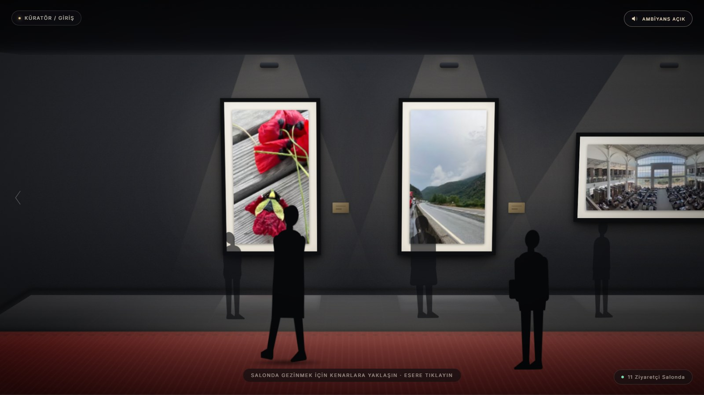
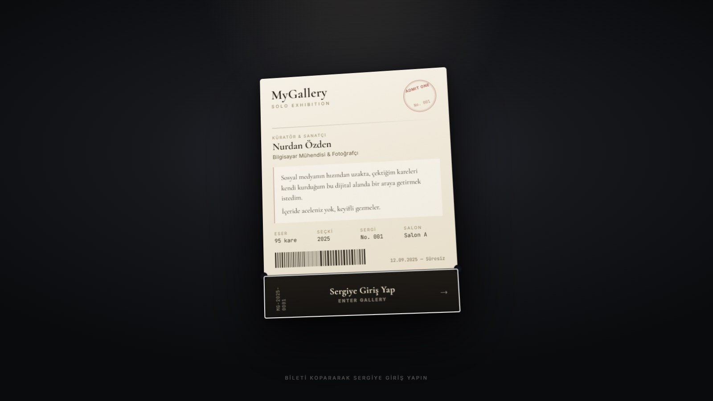
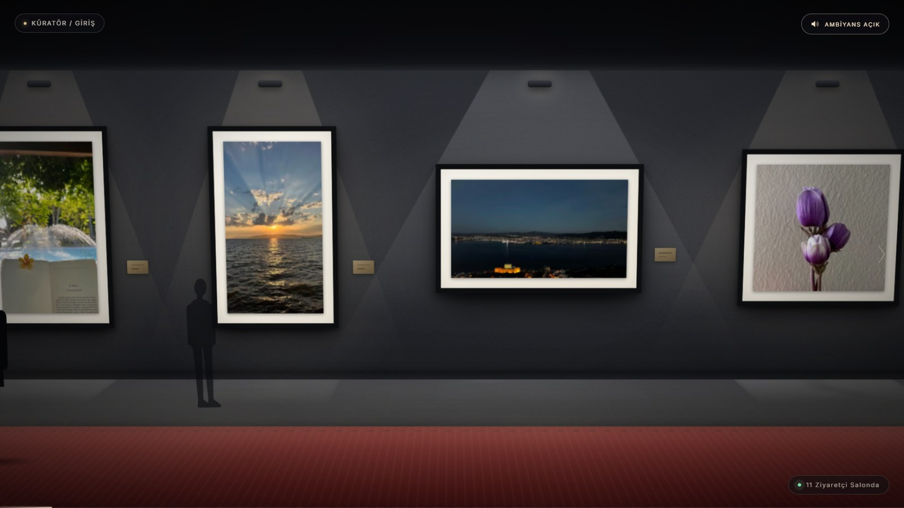
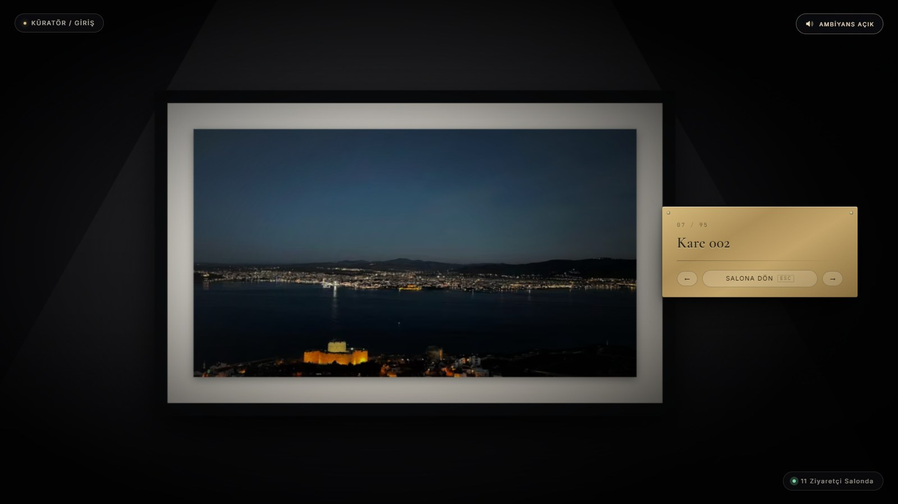
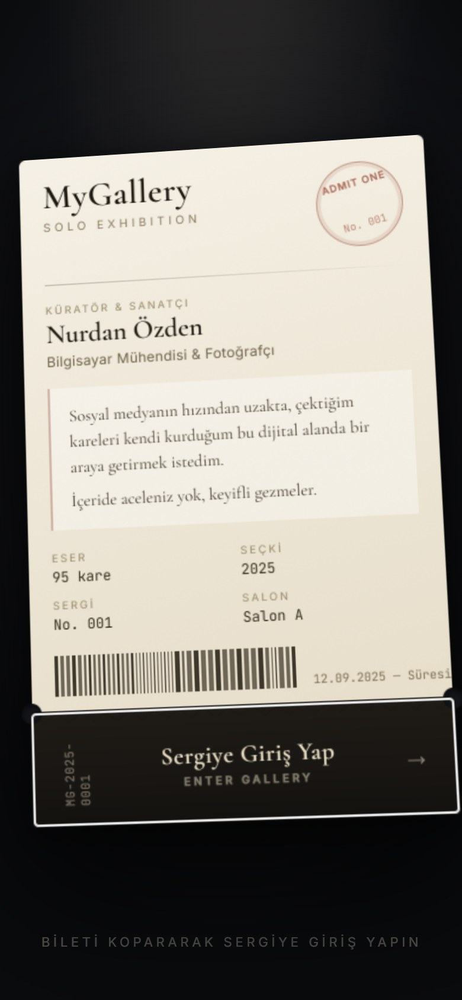
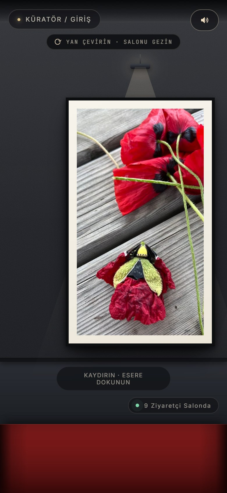
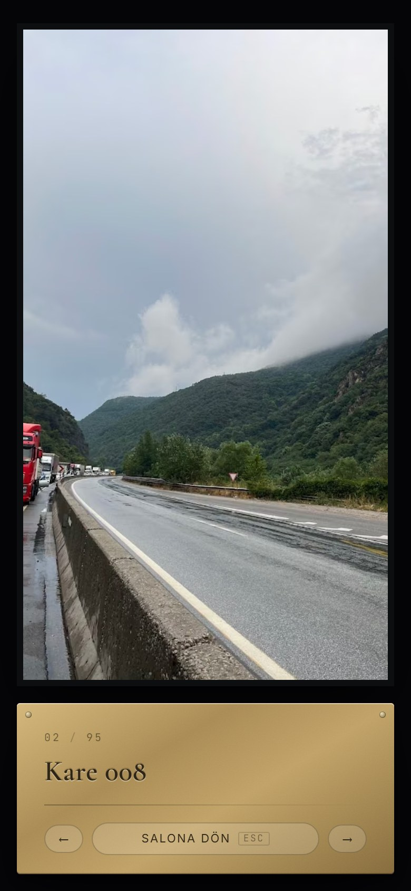

<div align="center">

# 🎟️ MyGallery

### Tarayıcıda gezilen dijital bir solo fotoğraf sergisi

Bileti koparın, ışıklar yansın, salona girin.

<br />

[](https://my-gallery-git-main-nurdans-projects-5cb86695.vercel.app/)


<br />

<a href="https://my-gallery-git-main-nurdans-projects-5cb86695.vercel.app/">
  
</a>

<sub>🔊 En iyi deneyim için sesi açın.</sub>

</div>

---

## ✨ Nedir?

Fotoğraflarımı sıradan bir galeri sayfasına dizmek istemedim; bir sergiye gitme **hissini** vermek istedim.

Ziyaretçiyi önce bir **sergi giriş bileti** karşılar. Bileti koparınca ışıklar sırayla yanar
ve karanlık bir galeri salonuna girilir. Eserler spot ışıkları altında duvarda asılıdır, cilalı
parkede bordo kadife bir halı uzanır ve salonda ağırbaşlı adımlarla dolaşan ziyaretçi siluetleri
vardır. Bir esere tıklandığında kamera onun tam karşısına süzülür, salon kararır ve duvara monte
**pirinç künye** belirir.

> Tek bir 3B kütüphanesi ya da ses dosyası yoktur. Salon **saf CSS 3D** ile kurulur, ses ise
> tarayıcıda **Web Audio** ile anlık üretilir.

---

## 📸 Ekran Görüntüleri

<table>
  <tr>
    <td width="50%">
      
      <p align="center"><b>1 · Giriş bileti</b><br /><sub>Koparma çizgisinden yırtılır, ışıklar sırayla yanar.</sub></p>
    </td>
    <td width="50%">
      
      <p align="center"><b>2 · Salonda gezinti</b><br /><sub>İmleci kenara yaklaştırın; duvar boyunca yürüyün.</sub></p>
    </td>
  </tr>
  <tr>
    <td colspan="2">
      
      <p align="center"><b>3 · Odak modu</b><br /><sub>Kamera esere döner, salon kararır, pirinç künye açılır.</sub></p>
    </td>
  </tr>
</table>

### 📱 Mobilde

Telefonda salon, yatay kaydırılan bir koridora dönüşür; esere dokununca tam ekran sunum açılır.

<p align="center">
  
  &nbsp;
  
  &nbsp;
  
</p>

---

## 🌟 Öne Çıkanlar

| | |
|---|---|
| 🏛️ **WebGL'siz 3B salon** | Duvarlar, zemin, tavan ve spot ışıkları yalnızca CSS 3D dönüşümleriyle kurulur. Kamera `requestAnimationFrame` ile sürülür. |
| 🚶 **Yaşayan salon** | Ziyaretçi siluetleri salonda dolaşır; ön plandakiler net, duvara yakın olanlar küçük ve puslu görünür. |
| 🎹 **Dosyasız ses** | Lofi piyano, salon uğultusu ve ayak sesleri Web Audio ile üretilir. Ses figürün bulunduğu yönden gelir; halıda boğuk, parkede tok çıkar. |
| ⚡ **Hızlı yükleme** | 100 eserlik sergide bile yalnızca kameranın etrafındaki eserler yüklenir. İlk görünüm yarım MB'ın altındadır. |
| 🛠️ **Otomatik fotoğraf hattı** | Tek komutla AVIF/WebP boyları, EXIF bilgileri, baskın renkler ve kronolojik sıralama hazırlanır. |
| ♿ **Erişilebilirlik** | Klavyeyle tam gezinti, `aria` etiketleri ve `prefers-reduced-motion` desteği vardır. |

---

## 🎮 Kontroller

| Etkileşim | Sonuç |
|---|---|
| Fareyi ekranın sağ/sol kenarına yaklaştır | Duvar boyunca yürür; kenara ne kadar yakınsa o kadar hızlı |
| Fare tekerleği / trackpad | Uzun duvarda hızlı yol alır |
| Kenarlardaki `‹` `›` okları · `←` `→` | Bir sonraki çerçeve grubuna kayar |
| `Home` / `End` | Serginin başına / sonuna gider |
| Esere tıkla | Odak modu: kamera esere döner, künye açılır |
| `←` `→` (odak modunda) | Önceki / sonraki esere geçer |
| `Esc` veya boşluğa tıkla | Genel plana döner |
| Sol üst · **Küratör / Giriş** | Bileti yeniden açar |
| Sağ üst · **Ambiyans** | Sesi açar / kapatır |

---

## 🚀 Kurulum

```bash
cd mygallery
npm install
npm run dev      # http://localhost:5173
npm run build    # üretim derlemesi -> dist/
```

---

## 🖼️ Kendi Sergini Kur

### 1. Fotoğrafları ekle

Orijinal JPG'leri `photos-original/` klasörüne bırak, sonra:

```bash
npm run photos
```

Bu komut:

- her fotoğraftan üç boy (480 / 800 / 1280 px) **AVIF + WebP** üretir,
- EXIF'ten diyafram, enstantane, ISO, odak uzaklığı ve çekim tarihini okur,
- `portrait / landscape / square` yönünü belirler ve karenin üç ana rengini çıkarır,
- kareleri **çekim tarihine göre** kronolojik sıralar.

Orijinaller `.gitignore`'dadır; repoya yalnızca optimize edilmiş kopyalar girer. Değişmeyen
fotoğraflar önbellekten geçer (`--force` ile hepsi baştan üretilir).

### 2. Künyeleri yaz

Başlık, yer ve hikâye `src/content/photoMeta.ts` içinde durur:

```ts
export const photoMeta: Record<string, PhotoMeta> = {
  'sessizligin-esigi': {
    title: 'Sessizliğin Eşiği',
    place: 'Bozcaada',
    story: 'Kadrajın arkasındaki 1-2 cümlelik hikâye.',
  },
}
```

`npm run photos` bu dosyayı **asla ezmez**, yalnızca yeni fotoğraflar için boş satır açar. Boş
alanlar otomatik değere düşer, yani tek satır yazmadan da sergi eksiksiz açılır.

> `photos-original/` boşsa demo seçki asılır. Sergi hiçbir zaman boş duvarla açılmaz.

### 3. Bilet metinlerini düzenle

`src/content/exhibition.ts`: adın, unvanın, manifesto cümlelerin, sergi numarası, tarihler ve
buton metinleri.

---

<details>
<summary><b>🔊 Ses tasarımı</b></summary>

<br />

Hiçbir ses dosyası yoktur; her şey tarayıcıda Web Audio ile canlı üretilir. Bu yüzden sergi her
açılışta biraz farklı duyulur ve siteye ağırlık binmez.

- **Lofi piyano:** C minör pentatonik üzerinde 2.5–6 saniye arayla rastgele düşen üçgen dalga
  notalar, üretilmiş 3.4 saniyelik bir reverb'den geçer. Arada ikinci bir alçak nota eşlik eder.
- **Ayak sesleri:** Siluetlerin adımlarıyla senkron tetiklenir (CSS yürüyüş döngüsüyle aynı
  0.43 s tempo). Ses figürün kameraya göre konumundan gelir, yaklaştıkça yükselir; halıda boğuk,
  parkede tok çıkar.
- **Salon uğultusu:** 420 Hz'den kesilmiş kahverengi gürültü.

Sesin tamamı bilinçli olarak çok kısıktır (tepe ≈ −32 dBFS).

</details>

<details>
<summary><b>⚡ Yükleme stratejisi</b></summary>

<br />

100 eserlik bir sergide hiçbir zaman 100 fotoğraf inmez.

- **Gömülü ön izleme:** Her karenin 24 px'lik bulanık kopyası manifest'te base64 olarak durur.
  Ayrı istek yoktur ve çerçeve gerçek dosya inene kadar boş kalmaz.
- **Yükleme halkası:** Kameranın etrafındaki ~17 eserlik halka dışındaki hiçbir eser DOM'a
  girmez. Ekrandakiler `fetchpriority=high`, çevredekiler düşük öncelikle iner.
- **Ölçüye göre boylar:** 480 / 800 / 1280 px, her biri AVIF ve WebP. Dört cihaz profilinde
  ölçüldü; her cihaz ihtiyacının en fazla 1.4 katını indirir.
- **Zemin yansımaları** gömülü ön izlemeyi kullanır; halka başına 17 istek eksilir.
- **Bilet ekranında sıfır fotoğraf iner.** Salona girişte ~5, birkaç saniye sonra ~12 dosya.
  Toplam ilk görünüm yarım MB'ın altındadır.

</details>

<details>
<summary><b>🧱 Mimari</b></summary>

<br />

```
src/
  content/
    exhibition.ts      Bilet ve sergi künyesi metinleri
    photos.ts          Manifest + künyeyi birleştirip duvara asılan listeyi üretir
    photoManifest.ts   ÜRETİLİR: boyutlar, EXIF, ön izleme (elle düzenleme)
    photoMeta.ts       Künye: başlık, yer, hikâye
    demoPhotos.ts      Fotoğraf yokken asılan demo seçki
  lib/
    room.ts            Salon geometrisi, asma düzeni, kamera, yükleme halkası
    photoSources.ts    srcset / AVIF listelerini kurar
    placeholder.ts     Demo modun yer tutucu baskı üreteci
    ambience.ts        Web Audio ile lofi ambiyans + ayak sesleri
    useViewport.ts     Ölçek ve medya sorguları
  components/
    TicketGate.tsx     Bilet ve koparma animasyonu
    Gallery.tsx        3B salon, kamera rig'i, odak modu
    Visitors.tsx       Siluetlerin dolaşma döngüsü
    Silhouette.tsx     Ziyaretçi siluet çizimi
    Plaque.tsx         Pirinç müze künyesi
    Hud.tsx            Üst menü, ses, ziyaretçi sayacı
    MobileCorridor.tsx Mobil koridor
    PhotoImg.tsx       Ön izleme + srcset + öncelik
scripts/
  build-photos.mjs     Fotoğraf hattı (sharp + exif-reader)
```

Kamera her karede `requestAnimationFrame` ile sürülür: odak değişimlerinde ease-in-out geçiş,
salonda gezinirken imlece yumuşakça yetişen serbest takip. Siluetler de aynı kamera açılarını
CSS değişkeninden okuyup her zaman kameraya döner.

</details>

---

## 🗺️ Yol Haritası

Proje gelişmeye devam ediyor. Yeni kareler ve özellikler yolda.

---

<div align="center">

**Nurdan Özden** · Bilgisayar Mühendisi & Fotoğrafçı

[](https://my-gallery-git-main-nurdans-projects-5cb86695.vercel.app/)

<sub>Fotoğrafların tüm hakları sanatçıya aittir.</sub>

</div>
